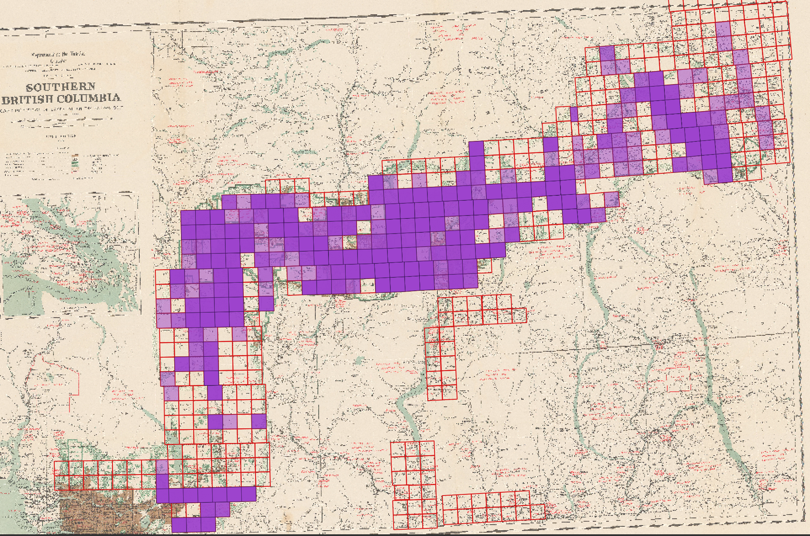
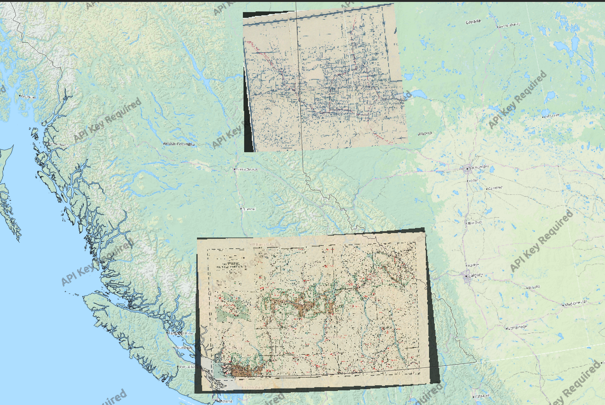
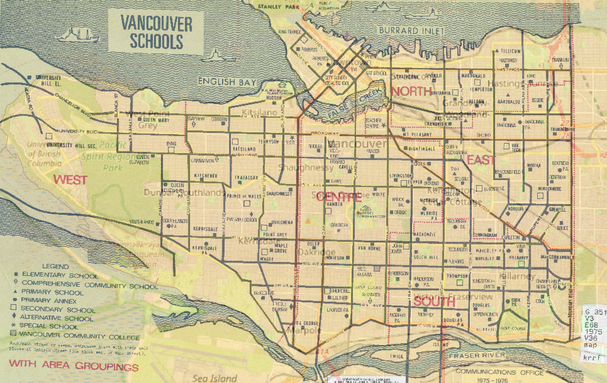

# Georeferencing 

**Georeferencing** appends coordinate information to non-spatial data, such as images. If you're working with historical maps and want to integrate them with other spatial data, georeferencing might be of interest to you. While historical maps represent a place, tracing geographic features such as roads, rivers, buildings, cities, and political boundaries, they cannot be read by a Geographic Information System (GIS) because the locational data for these features is not stored in a manner legible to the GIS––i.e., in latitude/longitude coordinate pairs. Georeferencing is the process of warping an image so that its geographic features match the location of those on a known geospatial layer. Note that georeferencing is not geocoding. Geocoding is when you have a tabular dataset with street addresses and you use a GIS to geolocate the data as coordinate points.

## Why georeference?
What do you hope to gain from georeferencing? How might georeferencing be useful in your area of research? There are many reasons one might want to georeference a historical map, included, but not limited to the following

>- to render maps query-able by location or attribute data
>- to add as a project basemap
>- to make comparison calculations
>- to serve as reference for creating shapefiles for spatial analysis or reference mapping

Below are some screenshots from georeferencing projects: 

<!-- [see this example](https://github.com/ubc-lib-geo/bc-dls/blob/master/spatial-index/spatial-index-workflow.md) -->

