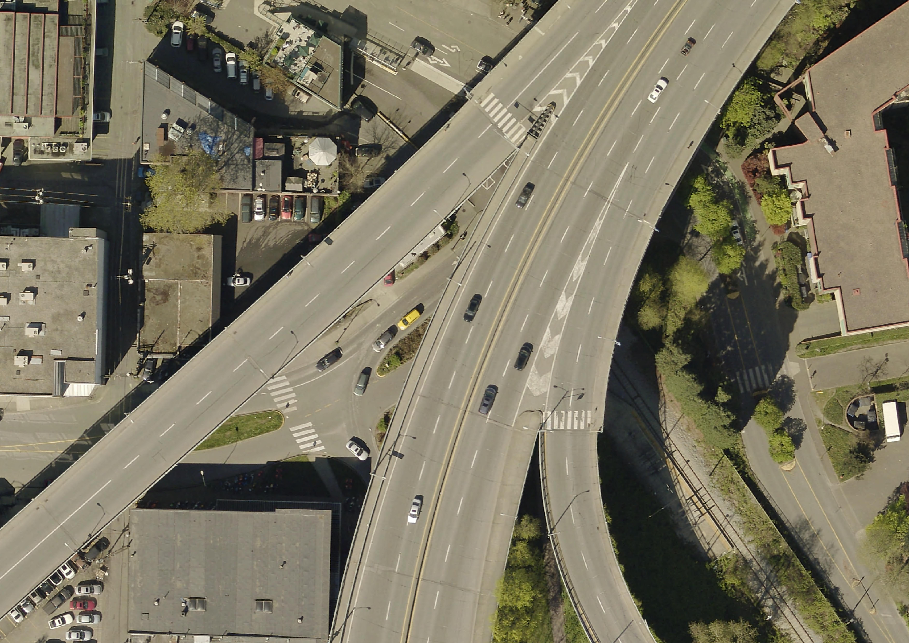

# Assembling your data
{: .no_toc}

It's now time to assemble your data. Take a moment to inventory what you have, as well as what you'll need by returning once more to the initial project design questions as outlined by your worksheet:

 - What data do you have? What data will you need?

 - Whose data is it? Are there any special permissions you need to obtain or access restrictions to be aware of? Note where you are storing your data, any associated licences/attributions, and ensure everyone who needs access has it.

 - What format is your data in (e.g. excel document, csv, text, image, geospatial file such as shapefile or .geoJSON, historical map…)? Is your data in current format legible to the software you intend to use? If not, do you need to convert any of it into a different format?
	-  As you work through choosing an appropriate software, it will become clearer whether or not your data's current form is legible to the software you intend to use. There are often ways to convert data between formats. For example, many geospatial formats can be converted from one to another in a GIS. [FME](https://fme.safe.com/) is a useful interoperability resource for more complex workflows, and they are generous with free student licenses. 

 - What aspect of your data is spatial? In other words, what is the location/geographical attribute? For example, is it a column of street address? The names of cities? Coordinate pairs?...
<!-- are there any location based attributes?
 (street address, geographic coordinates, city, town, country?) is there a map? (skills: geocoding, georeferencing, projecting) --> 
<!-- How to determine what's so spatial about your data.... (st addressses, then geocode) (given cities, spatial join to city layer in qgis OR add columns for xy data - copy paste from google maps  )(coordinates, display xy )(draw layer aoi in qgis) this all shows the myriad of ways data can be spatial spatializing data - (geocoding, displaying xy data) data analysis -->

 - Do you have physical or historical maps as part of your project? Do you need to scan them? If you're planning on using them in any way other than as decorative/informative archival images, you'll want to look into georeferencing. 

 
<!-- Below are some resources for finding more data or creating your own.  -->

  

    On this page:
  

  {: .text-delta }
 - TOC
{:toc}

----

## Considerations for assembling data
The data you’ll need depends on your mapping objectives. Maybe you already have data. Maybe you want to create a reference map and all you need is contextual information and the ability to add some labels and markers. Perhaps your research lab is collecting and processing the data for you. Whether your area of interest is local or global, whether your final map will be static, interactive, or simply the results of some spatial analysis… these factors will influence where you look for data. Municipal and federal data repositories are a good place to begin looking for geospatial reference data. If you have access to a data repository, either through a group you’re working with/for or institutional library for example, reaching out to whoever coordinates on the matter can be useful. You can also begin with a web search and see what is returned. Lastly, in some cases you can make your own data. This is particularly true if you only need a reference point or simple boundary outline. [Terrastories](https://terrastories.app/) and [Digital Democracy](https://www.digital-democracy.org/mapeo) are two great resources for collecting place-based data on the go. 

Whether you’re performing spatial analysis or making maps for yourself or a client, its important to keep a record of your data sources as you work. You’ll figure out a system that make sense to you. Trial and error a few times. However, The following considerations are useful to note somewhere like a document or notes file as you go.

> - What is the dataset of and where did you download it from (save a link)
> - What is the downloaded file called? Where is it stored on your computer/external storage device?
> - Is there a visual data preview such as an interactive web map?
> - What attributes are included in the dataset? 
> - Who is the dataset published by and is there a contact for questions? 
> - What is the dataset's license?
> - When was it last updated?
> - What formats can the dataset be downloaded in? 
> - What projections can the dataset be downloaded in?

## Geospatial data
A Geographic Information System (GIS) works with data that is tied to a location on Earth. This type of data is often referred to as "spatial data", "geospatial data", or even "GIS data", and is spatially referenced using location information — most commonly geographic coordinates. A GIS uses this location information to project a geospatial file into a virtual geographic space where it can then be visualized and analyzed. If your data's locative information in the form of countries, cities, or street addresses, this can be made legible to a GIS with a few extra steps (see [geocoding](https://ubc-library-rc.github.io/gis-plugins-qgis/content/geocoding.html)). 

[Geospatial data](https://researchguides.library.yorku.ca/c.php?g=679467&p=4793119) is often referred to as having two main types: **raster** and **vector**. These two data types, while both geospatial, are very different from one another. Raster data is data which is made up of pixels arranged in a grid, whereas vector data is made up of vertices and the paths between them – creating geometries that represent real-world features or phenomena. If you're working with continuous geospatial features such as satellite imagery, landuse/landcover data, topography, or climatic data, you're likely using raster data.  If you’re working with points, lines, or polygons, that’s likely vector data.

Below is a map consisting of vector data, with cities (points), major roads (lines), and land/water (polygons).

Note: Each vector dataset can only be lines, points, *or* polygons. However, a dataset can include multiple features, such as polygons representing all the provinces of Canada. For each feature (in this example, each province), various information may be stored such as a unique identifier, the area in square kilometers, the name, the population, etc. 

Rasters, on the other hand, can only store one value per pixel. This value could be a color representing different kinds of topography (think of the whites, greens,and browns representing different elevations) or the quantity of something like rainfall or temperature. Multiple rasters *can* be overlaid to generate a multi-part raster, but generally, each pixel of a single raster can store one value meaning your raster is showing one variable. You can also do math between rasters etc. 
    

Spatial data have different file extensions that you may be used to. Raster data will often be [TIF](https://en.wikipedia.org/wiki/TIFF) (aka TIFF) file and have the extention `.tif` or `.tiff`. Vector data come in more diverse file formats. The Shapefile is an industry standard format with the extension `.shp` (and a host of "sidecar files" — be sure to keep them all together). Shapefiles store data in binary, and it is therefore not legible to human eyes and can only be opened and visualized in a GIS. GeoJSON, however, stores vector data in `.geojson` files that can be opened in a code editor or online in [geojson.io](https://geojson.io/) and quite easily parsed with human eyes. See [here](https://gisgeography.com/gis-formats/) for an exhaustive list of formats spatial data can take. Although the nuance of file formats might seem too detail oriented for an introduction to reference mapping, being aware of different spatial data types and formats will help you know what to download and troubleshoot why something may not be opening/working. If you have no prior experience with spatial data, this may be quite overwhelming right now. However, with a little bit of practical experience under your belt this will quickly all become common sense to you. 

Finally, **tabular data** is simply data formatted into a table by rows and columns. All vector data has associated tabular data that can be opened and viewed inside a GIS. Your tabular data may have a spatial component, like coordinates, or it may not. If a spatial component is present, you can simply load it into a GIS and tell the GIS to create a spatial layer by referencing the stored latitude and longitude (you will need to ensure lat and long are in separate columns, and the GIS is reading latitude as _y_  and longitude as _x_). If your tabular data does not have locative information, you can still load it into GIS and join it with a spatial layer that already exists based on a key value. However, your tabular data **must be in `.csv` format**, so be sure to export any excel sheets as `.csv`s (comma separated values) before attempting to load them into a GIS. 

----

## Finding geospatial data

So where do you find spatial data? Maybe you already have some, maybe you're still searching. A lot of spatial data is accessible via the internet, albeit under different licenses. Outside of this workshop, you might begin your search on UBC Library's [GIS website](https://gis.ubc.ca/data/). If you are a UBC student, staff, or faculty, you'll also have access to the [Abacus Data Network](https://abacus.library.ubc.ca/) which contains lots of data, including historical datasets. Municipal and governmental agencies local to your project are also great places to begin looking. For example, see for Vancouver the [Vancouver Open Data Portal](https://opendata.vancouver.ca/pages/home/), [Data BC](https://catalogue.data.gov.bc.ca/) for Provincial data, and [Natural Resources Canada](https://natural-resources.canada.ca/science-data/data-analysis/geoca) for national resource data. Many Canadian cities have their own municipal open data source, though downloading the data will be different depending on the platform used by each city (see our workshop on [Tools and Workflows](https://ubc-library-rc.github.io/gis-tools-workflows/content/downloading-data.html) for guidance).

[Natural Earth](https://www.naturalearthdata.com/downloads/), which we will use today, provides  free, public domain raster and vector data at a global scale. For example, you can download country and state outlines (and from various state-based perspectives), rivers/lakes/reservoirs, oceans and coastlines, and landmasses. You can also download hillshade data from Natural Earth whose symbology you can adjust in QGIS to show topography. This makes it an excellent resource for simple reference mapping for academic publication.

The [Humanitarian Data Exchange](https://data.humdata.org/) contains lots of useful global data. [WorldClim](https://worldclim.org/) publishes historical climate data such as precipitation and temperature, which you can download as raster datasets. For free and open-source infrastructural data, see [Open Street Maps (OSM)](https://www.openstreetmap.org/#map=11/49.2151/-123.0393). Refer to our [Plugins in QGIS Workshop](https://ubc-library-rc.github.io/gis-plugins-qgis/content/extracting-osm-data.html) for a demonstration of how to extract and download OSM data or use it as a basemap for your maps. 

Satellite imagery can often be downloaded directly from providers. For example, download Sentinel data from the [Copernicus Browser](https://browser.dataspace.copernicus.eu/?zoom=5&lat=50.16282&lng=20.78613&demSource3D=%22MAPZEN%22&cloudCoverage=30&dateMode=SINGLE). If you're using QGIS, the [SRTM-Downloader](https://plugins.qgis.org/plugins/SRTM-Downloader/) plugin is a handy tool to download NASA data for a specific area of interest directly from within your GIS interface. If you are a UBC student, staff, or faculty, you can [request a Planet account](https://researchcommons.library.ubc.ca/planet-imagery/) to gain access to much more imagery. Refer to our [Project Design workshop and resource](https://ubc-library-rc.github.io/gis-spatial-stories/content/resources-for-data-assembly.html) for important considerations as you search, download, store, and use data.

Finally, you can always create your own vector layers, or create new shapefiles within a GIS by tracing existing data. If you are working with historical or physical maps and want to digitize them or otherwise create spatial data using them as template, see our workshop on [georeferencing](https://ubc-library-rc.github.io/gis-georeferencing/) or our [georeferencing resource page](https://ubc-library-rc.github.io/gis-spatial-stories/content/resources-for-georeferencing.html). 

### Municipal and Provincial Vector Data 
{: .no_toc}
- [BC Data](https://catalogue.data.gov.bc.ca/)
- [Administrative and Statistical Boundaries 2021 ](https://www12.statcan.gc.ca/census-recensement/2021/geo/sip-pis/boundary-limites/index2021-eng.cfm?year=21)(e.g., provinces, census divisions, dissemination areas)
- [City of Vancouver open data portal](https://opendata.vancouver.ca/pages/home/)
- [Metro Vancouver open data portal](https://open-data-portal-metrovancouver.hub.arcgis.com/)
- [Burnaby open data portal](https://data.burnaby.ca/)
- [Victoria](https://opendata.victoria.ca/) 
- [Guelph](http://data.open.guelph.ca/)
- [Toronto](https://open.toronto.ca/)
- [Kelowna](https://opendata.kelowna.ca/)
- [Kamloops](https://mydata-kamloops.opendata.arcgis.com/)
- [Calgary](https://data.calgary.ca/) 

### Global Census Data 
{: .no_toc}
- [World urbanization](https://population.un.org/wup/DataQuery/)
- [World demographics](https://population.un.org/dataportal/home?df=d7cac223-d504-404f-807a-03d475ad6c63)

### Global Boundary Files
{: .no_toc}
- [Natural Earth data](https://www.naturalearthdata.com/downloads/) 
- [USA TIGER line shapefiles](https://www.census.gov/geographies/mapping-files/time-series/geo/tiger-line-file.html)
- [Earthworks Stanford](https://earthworks.stanford.edu/)
- [The Humanitarian Data Exchange](https://data.humdata.org/dataset)

### Street Network Examples
{: .no_toc}
- [OSM Street Network](https://www.openstreetmap.org/#map=11/49.2465/-123.0908&layers=H) (see [downloading OSM data in QGIS](./osm-downloader.md))
- [canada road network file](https://www12.statcan.gc.ca/census-recensement/2021/geo/sip-pis/rnf-frr/index2021-eng.cfm?year=21)
- [USA Primary Roads](https://catalog.data.gov/dataset/tiger-line-shapefile-2019-nation-u-s-primary-roads-national-shapefile)
- [India Roads (2016)](https://geodata.mit.edu/catalog/stanford-qf525mn4696)
- [EU Major Road Network](https://data.europa.eu/data/datasets/major-road-network?locale=en)

### Climate, Landcover, and Satellite Imagery
{: .no_toc}
- If you are a member of UBC, you have access to imagery from [Planet.com](https://www.planet.com/). See [here](https://researchcommons.library.ubc.ca/planet-imagery/) for more information and instructions on requesting a free account. 
- QGIS [SRTM downloader](https://plugins.qgis.org/plugins/SRTM-Downloader/) plugin
- You can also [add a basemap](https://ubc-library-rc.github.io/gis-tools-workflows/content/add-basemap.html) to a GIS project, allowing you to access decent quality satellite imagery for research and noncommercial purposes.
- [World Climate Data](https://www.worldclim.org/)
- [World Land Cover](https://data.apps.fao.org/catalog/iso/8cf69f76-1be0-4339-a0b0-18a93c7f4760)
- [World Land Cover (2)](https://viewer.esa-worldcover.org/worldcover/)
- [Places to download free satellite imagery](https://gisgeography.com/free-satellite-imagery-data-list/)
- [Canada Land Cover](https://natural-resources.canada.ca/maps-tools-publications/satellite-imagery-air-photos/application-development/land-cover/21755)
- [Canada DEM](https://open.canada.ca/data/en/dataset/957782bf-847c-4644-a757-e383c0057995)
- [BC Lidar](https://lidar.gov.bc.ca/pages/download-discovery)

----

#### Learn more about Geospatial Data
<!-- - Explore UBC Library's compendium of data sources for Canada and the world [HERE](https://guides.library.ubc.ca/gis/datasources) -->
- [Koerner Library Data Source Guide](https://guides.library.ubc.ca/gis/datasources)
- Also checkout UBC's GIS specific data page at [gis.ubc.ca/data/](https://gis.ubc.ca/data/)
- [More than you ever wanted to know about GeoJSON - Tom MacWright](https://macwright.org/2015/03/23/geojson-second-bite.html)  
	