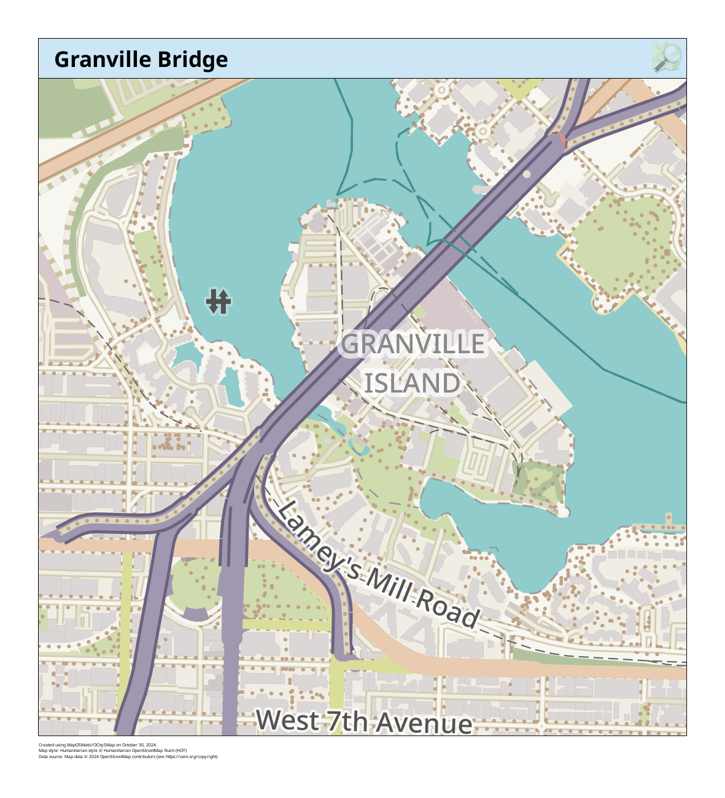

# Resources for Static Mapping & Spatial Analysis
{: .no_toc}

This page will inventory a variety of platforms, tools, and resources for making static maps, whether they be reference maps or thematic maps. Generally, if you are making a thematic map you will need to use a geographic information system (GIS) of some sort. 

  

    On this page:
  

  {: .text-delta }
 - TOC
{:toc}

----

## Geographic Information Systems

### QGIS
[QGIS](https://qgis.org/) is a popular desktop GIS software, and considered a **f**ree and **o**pen **s**ource **s**oftware **(FOSS)** with a very active development community. QGIS can be downloaded from [qgis.org/download/](https://qgis.org/download/). In most cases, you’ll want to download and install the Long Term Release (LTR) instead of the latest release. This will give you most of the functionality you’ll need, without encountering the software bugs of newly released versions.

The best way to learn QGIS is through the experience that comes with hands-on practice. QGIS has with a medium learning curve, especially if you've never used a GIS before. However, don't let this dissuade you! There is a an abundance of QGIS-official and unofficial documentation on the internet in the form of tutorials and youtube demonstrations. This means you can tailer your learning experience to your interests and the specific needs of your project.

> #### QGIS Advantages  ⇡
> {: .no_toc}
> - Free and open source 
> - Runs on Windows, Mac, Linux, Android
> - Extensive online documentation 
> - Intuitive interface
> - Active development and user communities, meaning people are constantly posing and answering questions on platforms such as Reddit and StackExchange. This makes troubleshooting a whole lot easier. 
> - Robust [plugin](https://plugins.qgis.org/) repository for extended functionality

> #### QGIS Disadvantages ⇣
> {: .no_toc}
> - Most recent features can be buggy, which is why we recommend always downloading the latest Long Term Release, often small hyperlink below main download button. 
> - Plugins lack standardized documentation as they are largely user-community developed and contributed
> - Troubleshooting often amounts to searching the web, though this is an important skill to have as a cartographer. 

#### QGIS Resources 
{: .no_toc}
- UBC Research Commons has two workshops to get you started: [Intro to Map Production with QGIS](https://ubc-library-rc.github.io/gis-intro-qgis/) and [Tools and Workflows in QGIS](https://ubc-library-rc.github.io/gis-tools-workflows/). 
- QGIS itself has extensive online documentation, including a robust [User Guide](https://docs.qgis.org/3.34/en/docs/user_manual/index.html#) *and* [Training Manual](https://docs.qgis.org/3.34/en/docs/training_manual/index.html). QGIS also has a vibrant user community, with answers to nearly any question you might have only a web search away. Many helpful tutorial demonstrations can be found on Youtube. [CWU Geography](https://www.youtube.com/@cwugeography3290) offers especially clear and helpful content. 
<!-- - [making a heatmap in QGIS](https://www.qgistutorials.com/en/docs/3/creating_heatmaps.html) -->
    
 

### ArcGIS Pro 

[ArcGIS Pro](https://www.esri.com/en-us/arcgis/products/arcgis-pro/overview) is a proprietary desktop GIS that requires either a personal or institutional license. If you are faculty or student at UBC, you can learn more about obtaining access [here](https://gis.ubc.ca/software/#:~:text=FOR%20STUDENT%20PERSONAL%20COMPUTERS&text=This%20%2420%20license%20includes%20ArcGIS,reduced%20cost%20is%20also%20available.&text=This%20is%20a%20non%2Drefundable,installed%20on%20personal%20computers%20only.). ArcGIS has a medium learning curve. There is moderate documentation online, though many of the training courses & books Esri offers require payment to attend.

> #### ArcGIS Advantages  ⇡
> {: .no_toc}
> - Advanced suite of tools for vector analysis and image processing, including both 2D and 3D visualization. 
> - Companies that have the means to purchase industry licenses will often expect employees to know ArcGIS. 

> #### ArcGIS Disadvantages ⇣
> {: .no_toc}
> - ArcGIS Pro is a proprietary software, meaning it is not free to download and you cannot view the program's source code.
> - ArcGIS Pro only runs on Windows operating system. If you have a license, you can log in on a Windows computer such as those in Koerner Library or use something like [Parallels](https://www.parallels.com/products/desktop/) to run a virtual Windows machine on your mac. However, this latter option takes up a lot of processing power on your computer, meaning it's likely to crash often and wear out your battery. 
> - Licensing is a hassle, and collaboration can only occur between people who both own an active license. 

 

### Other open-source GIS platforms
{: .no_toc}
While this workshop favors QGIS and the Research Commons exclusively runs QGIS workshops, [Grass GIS](https://grass.osgeo.org/) and [Open Jump GIS](https://www.openjump.org/) are two other open-source GIS platforms out there. 

----

## Non GIS options for making static maps
If you just want a quick reference map but don't want to use a GIS, you have a couple of options. 

### MyOSMatic
"MapOSMatic is a free software webservice to generate maps of cities using OpenStreetMap data". [MapOSMatic](https://print.get-map.org/) allows you to create basic reference maps with just a few clicks. It is very easy to use, but has little room for customization. It is an entirely web-based interface and requires no prior expertise. The maps below were created in minutes using MyOSMatic. 

### Static Map Maker
[Static Map Maker](https://staticmapmaker.com/mapbox/) allows you to easily create and download a static reference map by supplying copy-paste information for just a few parameters. You can choose from Bing, Google Maps, Google Street View, HERE, and MapQuest map backgrounds (aka basemaps). Once you've selected a basemap provider of your choice, you will notice the landing page says "authentication required". This means you _will_ need an API key (access token) to use any of the basemaps. While all these platforms are proprietary, you can create a free Mapbox or HERE account for an API key.  (Scroll down to where it says _How to use_ and there will be a hyperlink to get an API key for the respective basemap.) The below maps were created in minutes using Static Map Maker with a Mapbox api key.

### Map Creator
If you don't want to use a GIS yet want more aesthetic static maps than the above option can offer, [Mapcreator](https://mapcreator.io/) may be of interest. Mapcreater offers a web-based interface for designing and downloading maps. However, it works on a paid subscription with even the lowest tier being quite pricy. You can always try a 14-day free trial if you have a one-off project, or want to see if it is worth budgeting for in your project. Notice, however, that Mapcreater uses OpenStreetMap data. Remember that [OpenStreetMap (OSM)](https://www.openstreetmap.org/#map=2/71.3/-96.8) is free and open source, meaning you can freely use it to make reference maps on your own either in QGIS or MyOSMatic.

### Mapbox Studio
[Mapbox](https://www.mapbox.com/), which is be further elaborated in **Resources for Web Mapping**, offers a service called [Mapbox Studio](https://docs.mapbox.com/help/dive-deeper/static-maps/) whereby you can create static maps from within an online interface. 

----

## Illustration Software

### Adobe Illustrator, GIMP, & Inkscape
{: .no_toc}
You can also use illustration software either to make an entire rudimentary map using SVG vector graphics, or to embellish an initial map produced with a GIS. **[Adobe Illustrator](https://www.adobe.com/ca/products/illustrator.html)** is a proprietary and costly option, though does have a free trial so long as you remember to cancell. **[Inkscape](https://inkscape.org/release/inkscape-1.2.2/)** is a free and open-source alternative SVG editor. Inkscape has a steep initial learning curve if you you are unfamiliar with an illustration software's interface, but there's plenty of documentation online and it is a handy tool to know. **[GIMP](https://www.gimp.org/)** is a free and open-source image editor, akin to Adobe Photoshop. You can work with raster data in GIMP whereas it's more difficult to do so in Inkscape or Illustrator. However, if you're using a GIS like QGIS to edit and modify your data, you can always use an illustration software for more advanced styling.  

Below is an example map made by the workshop author, Lily Demet, for UBC Disaster Resilience Research Network Report. The data for this map was gathered, modified, and analyzed in QGIS and then exported into Inkscape, where all the stylistic work took place.

----
#### Resources for map design
- [Axis Maps Cartography Guide](https://www.axismaps.com/guide) offers tips for map design
- [DIY Cartography - Resources & Ideas](https://makingmaps.net/)
- [Books for the love of cartography by Gretchen N. Peterson](https://www.gretchenpeterson.com/) such as *[QGIS Map Design](https://locatepress.com/book/qmd2)* and *Cartographer's Toolkit*
- [Decolonizing the map](https://press.uchicago.edu/ucp/books/book/chicago/D/bo25338607.html)
- See more Cartographic Media from [CartoSquad](https://cartosquad.com/media.html)
- [Cartographic Design](https://colorado.pressbooks.pub/makingmaps/chapter/cartographic-design-process/)
- [Visual Hierarchy and Layout for maps](https://gistbok-topics.ucgis.org/CV-03-007)
- [Color Brewer](https://colorbrewer2.org/#type=sequential&scheme=BuGn&n=3) helps you create an appealing color scheme based on any number of classes
- [Build a colorblind friendly palette](https://davidmathlogic.com/colorblind/#%23D81B60-%231E88E5-%23FFC107-%23004D40) based on a color of your choice

