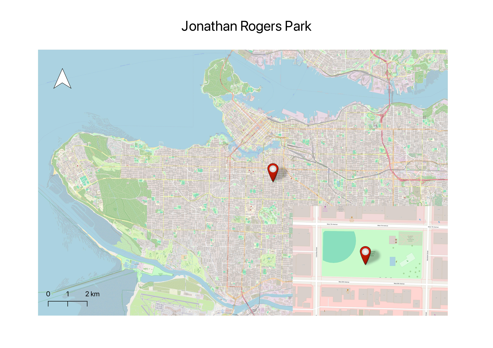
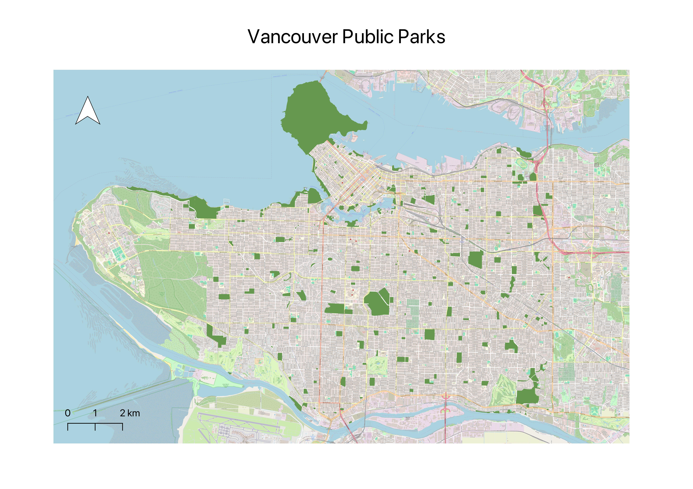
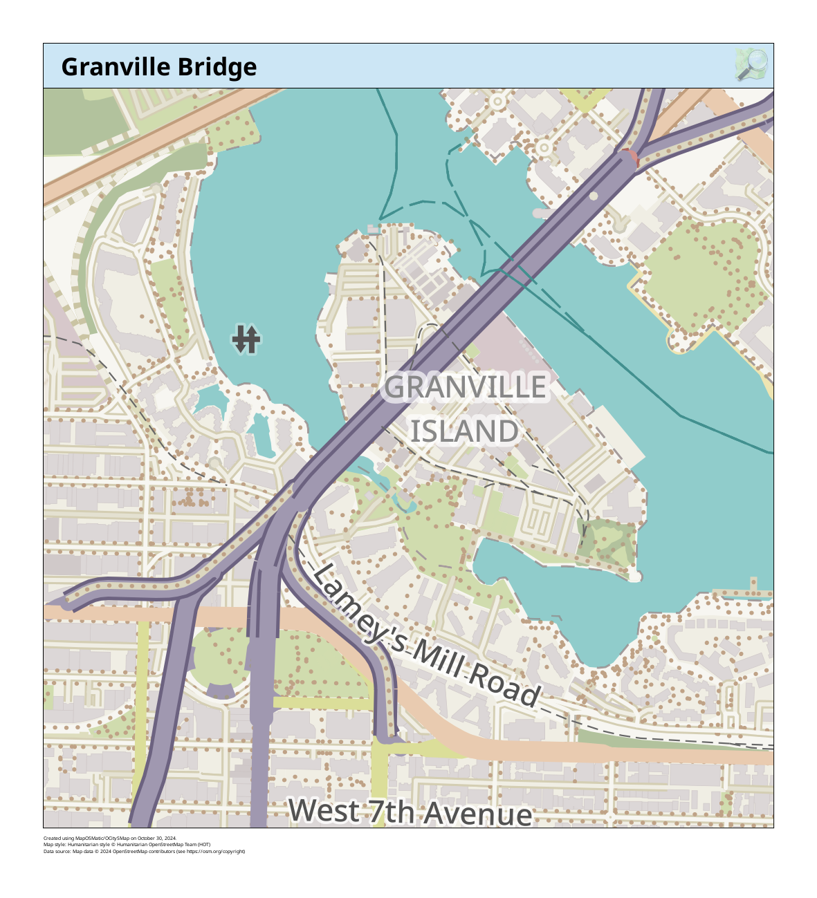
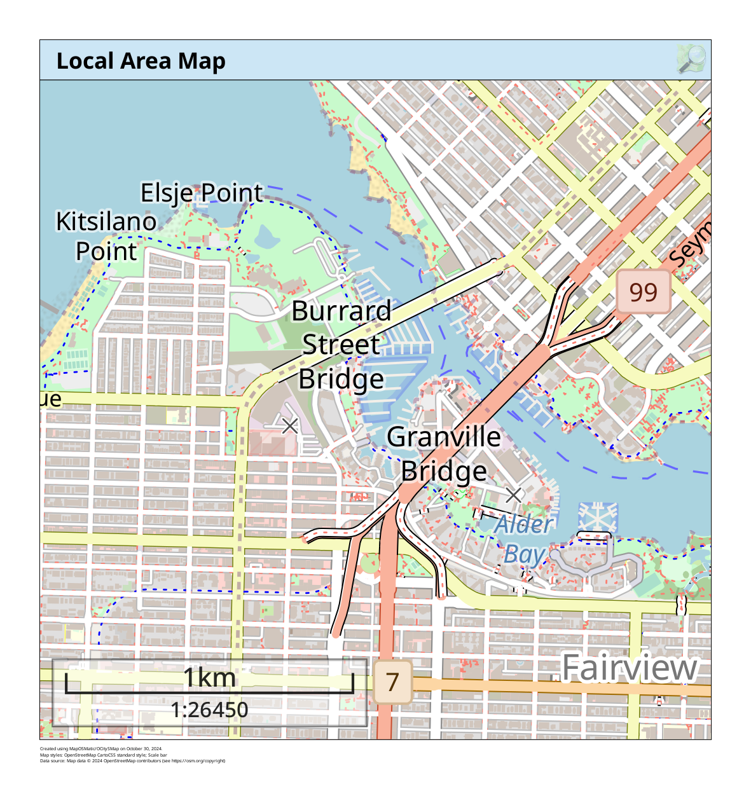
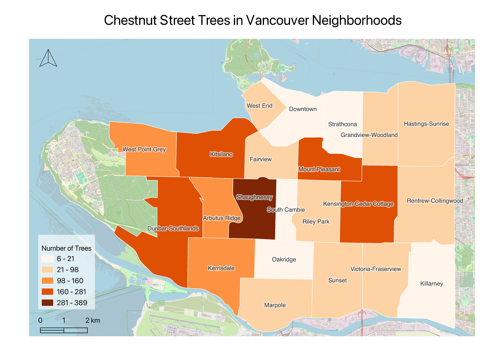
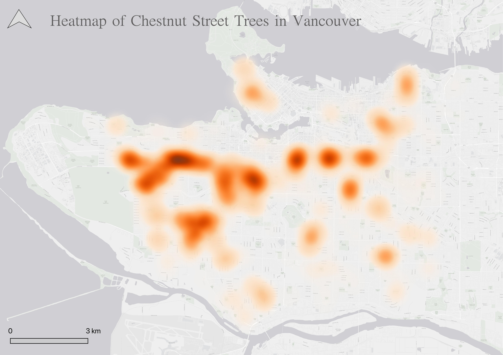

# Static Maps
{: .no_toc}

There a variety of spatial stories you can tell with a static map. Static maps can be as simple as to provide geographic reference for your story,  or they can be as elaborate as to visualize the results of spatial analysis. This page describes both **reference** and **thematic** static maps, and provides illustrative examples. 

  

    Table of contents
  

  {: .text-delta }
 - TOC
{:toc}

----

## Reference Maps
Reference maps are useful to show the lay of the land, such as geospatial context surrounding your area of interest. Read more about different kinds of reference maps [here](https://www.mapize.com/reference-maps-a-complete-guide/). 

Reference maps can be as simple as a drop pin location, with an optional inset. Insets either zoom-in on a select area in order to show it in greater detail, or they zoom-out to put a select area in wider context.

Reference maps can also display a single data layer, such as Vancouver Parks:

Reference maps can simply show urban infrastructure in a specific area:

<!-- See [Vancouver's bike map](https://vancouver.ca/files/cov/map-cycling-vancouver.pdf) for a handy reference guide to all the bike-friendly streets around the city. 
 -->

### More reference map examples 
{: .no_toc}
- 
- 
- 
- 

    

----
    

  
## Thematic Maps & Spatial Analysis
Writes _Statistics Canada_: "A thematic map shows the spatial distribution of one or more specific data themes for standard geographic areas."
[Thematic maps](https://en.wikipedia.org/wiki/Thematic_map) render the results of **Spatial anlaysis**. 

 >>  **Spatial analysis** is the process of manipulating spatial information to extract new information and meaning from the original data. Usually spatial analysis is carried out with a Geographic Information System (GIS). A GIS usually provides spatial analysis tools for calculating feature statistics and carrying out geoprocessing activities as data interpolation. -- [QGIS](https://docs.qgis.org/2.18/en/docs/gentle_gis_introduction/spatial_analysis_interpolation.html#:~:text=Overview,Geographic%20Information%20System%20(GIS).)
 
  If you have spatial questions you want to explore with your data, you'll likely need to perform some kind of spatial analysis with GIS. here are a couple GIS applications out there that can be downloaded from the web directly to your personal computer; these will be further described in **Assembling Resources**. Remember, you can alway email `library.gis@ubc.ca` or [book a consult](https://libcal.library.ubc.ca/appointments/research_commons#s-lc-public-pt) with the Research Commons' GIS team if you are not sure what your project will require. 

  Let's take a look at some examples of different kinds of thematic maps. You can read more about the pros and cons of different kinds of thematic maps [here](https://mapscaping.com/what-is-a-thematic-map/). 

### Choropleth Maps

Choropleth maps symbolize data by a gradient of intensity or occurrence relative to bounded areas such as neighborhoods, municipalities, our countries. Axis Maps has a great introduction to [choropleth maps](https://www.axismaps.com/guide/choropleth). Showing two variables at once? try making a [bivariate choropleth map](https://bnhr.xyz/2019/09/15/bivariate-choropleths-in-qgis.html) in QGIS.

<!--  -->

If you have a substantial amount of time, you can create elaborate, aesthetic maps using both a GIS and illustration software. The following map was made by the workshop author, Lily Demet, for UBC Disaster Resilience Research Network Report. 

 

### Heatmap
<!-- > or distance to a library or community center -->
A heatmap visualizes point data by occurrences. 

[making a heatmap in QGIS](https://www.qgistutorials.com/en/docs/3/creating_heatmaps.html)

<!-- cartogram and dot density require plugins in qgis-->

### Proportional Symbol map 
[Axis Maps](https://www.axismaps.com/guide/proportional-symbols)
(can also be made using inkscape or adobe illustrator)
> parks per vancouver neighborhood

>- [Multi variable proportional symbol maps](https://www.axismaps.com/guide/proportional-symbols)

### Dot Density Maps

http://www.axismaps.com.s3-website-us-east-1.amazonaws.com/guide/univariate/dot-density/

### More examples 
{: .no_toc}

Give some other examples from the web etc.

You can read more about the pros and cons of different kinds of thematic maps [here](https://mapscaping.com/what-is-a-thematic-map/).
 
 
----

