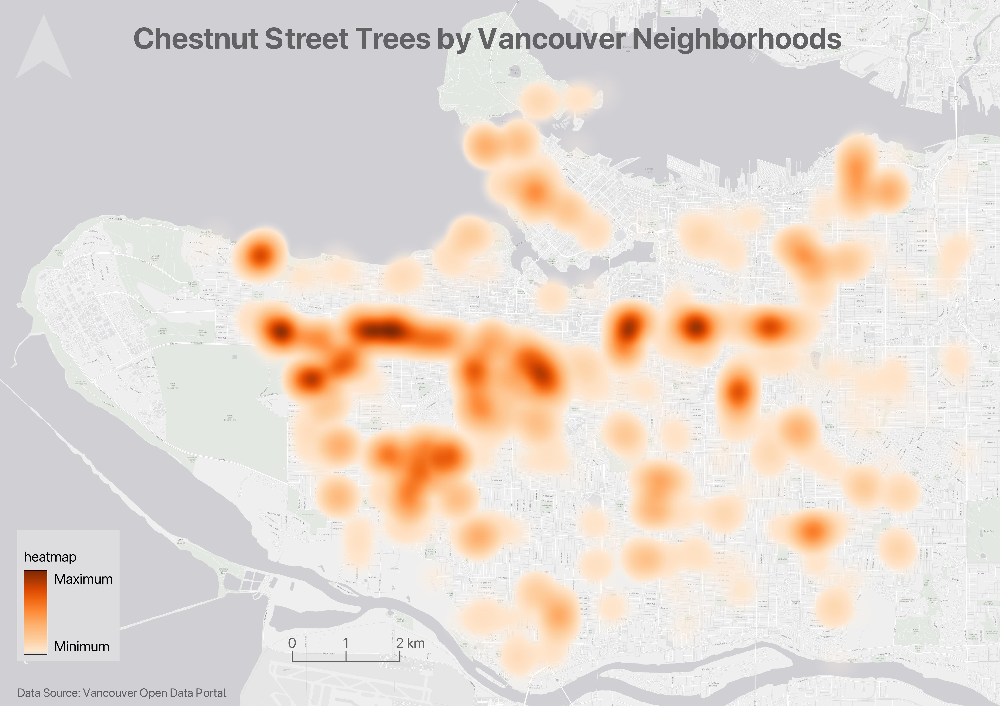

# Static Maps
{: .no_toc}

There are a variety of spatial stories you can tell with a static map. Static maps can provide geographic reference for your story, such as locating your research area or the countries visited by a historical figure. Static maps can show geophysical features such as mountains, rivers, or coastline, or show infrastructural networks, buildings, and aerial imagery. Static maps can also visualize the results of spatial analysis. This page describes two kinds of static maps: **reference maps** and **thematic maps**, and provides illustrative examples for each. 

  

    On this page:
  

  {: .text-delta }
 - TOC
{:toc}

----

## Reference Maps
Reference maps are useful to show the lay of the land, such as the geographic context surrounding your research area or area of interest. 

Reference maps can be as simple as a drop pin location, with an optional inset. Insets either zoom-in on a select area in order to show it in greater detail, or they zoom-out to put a select area into wider geographical context.

Reference maps can display a single data layer, such as Vancouver Parks.

Or multiple layers, such as parks and libraries.

    

Or, reference maps can simply show the geography or infrastructure in a specific area.

    
 

See [Vancouver's bike map](https://vancouver.ca/files/cov/map-cycling-vancouver.pdf) for a handy reference guide to all the bike-friendly streets around the city. 

 
 

----
    
  
## Thematic Maps & Spatial Analysis
Writes _Statistics Canada_: "A thematic map shows the spatial distribution of one or more specific data themes for standard geographic areas." [Thematic maps](https://en.wikipedia.org/wiki/Thematic_map) render the results of **Spatial anlaysis**. 

 >  **Spatial analysis** is the process of manipulating spatial information to extract new information and meaning from the original data. Usually spatial analysis is carried out with a Geographic Information System (GIS). A GIS usually provides spatial analysis tools for calculating feature statistics and carrying out geoprocessing activities as data interpolation. -- [QGIS](https://docs.qgis.org/2.18/en/docs/gentle_gis_introduction/spatial_analysis_interpolation.html#:~:text=Overview,Geographic%20Information%20System%20(GIS).)
 
If you have spatial questions you want to explore with your data, you'll likely need to perform some kind of spatial analysis within a GIS. There are a couple GIS applications out there that can be downloaded from the web directly to your personal computer; these will be further described in **Assembling Resources**. Remember, you can alway email `library.gis@ubc.ca` or [book a consult](https://libcal.library.ubc.ca/appointments/research_commons#s-lc-public-pt) with the Research Commons' GIS Team if you are not sure what tools/software your project will require. 

OK. Let's take a look at some examples of thematic maps. You can read more about the pros and cons of different kinds of thematic maps [here](https://mapscaping.com/what-is-a-thematic-map/). 

    

### Choropleth Maps

Choropleth maps are useful to show and compare the density, frequency, or quantity of a value generalized across standardized geographic areas (such as zip-codes, provinces, or countries). Unless you specifically want to emphasize differences in total number of events/data points, it is best practice to normalize your data when choropleth mapping. Normalization is when you divide the values for each geographic area by something like the area in square kilometers or total population of that area. For instance, mapping winter flu cases across census tracts in British Columbia, you’d want to normalize the total cases in each census tract by that tract’s total population. Normalization enables better comparison across multiple geographic areas.

Axis Maps has a great introduction to [choropleth maps](https://www.axismaps.com/guide/choropleth). Showing two variables at once? try making a [bivariate choropleth map](https://bnhr.xyz/2019/09/15/bivariate-choropleths-in-qgis.html) in QGIS.

<!--  -->

<!--html for two images-->
<html>
<link rel="stylesheet" href="./reference/style.css">

  
1 / 2

  
  <!-- 
Caption Text
 -->

  
2 / 2

  

<a class="prev1" onclick="plusSlides(-1)">❮</a>
<a class="next1" onclick="plusSlides(1)">❯</a>

   
   

</html>

If you have a substantial amount of time, you can create elaborate, aesthetic maps using both a GIS and illustration software. The following map was made by the workshop author, Lily Demet, for the UBC Disaster Resilience Research Network Report. 

 

### Proportional Symbol map 
Whereas choropleth maps use a color gradient to convey value differentials, proportional symbol maps use symbol sizes corresponding to total numbers in different geographic areas. Proportional symbol maps are therefor useful to visualize the quantity of something across respective locations. For instance, total number of earthquakes in each country or census tract. Proportional symbols are quite intuitive, and can be combined with other parameters like color and lettering size to provide rich spatial information. Proportional symbols can even be layered atop a choropleth map. See [Axis maps](https://www.axismaps.com/guide/proportional-symbols) for a guide to proportional symbol mapping. [You can also make multiple variable proportional symbol maps](https://www.axismaps.com/guide/proportional-symbols). Proportional symbol maps can be made in a GIS, or in an illustration software, or both. 

 

### Dot Density Maps
[Dot density maps](http://www.axismaps.com.s3-website-us-east-1.amazonaws.com/guide/univariate/dot-density/) are useful to show the concentration and distribution of discrete incidents. Each dot can represent an event (e.g., an earthquake), or a multiple such as 10. For more see [Axis Maps](https://www.axismaps.com/guide/dot-density). Dot Density maps can over-simplify.

 

### Heatmap
<!-- > or distance to a library or community center -->
Useful to show intensity or frequency of occurrence. Heatmaps can be thought about as generalized dot density maps.

 

### Cartograms

Cartograms distort area to emphasize the value associated with a geographic region. When using cartograms, it’s important to consider whether your audience is already familiar with the un-distorted geography, otherwise they might not glean the added information. If you're using QGIS as a mapping software, you'll need to install a [plugin](https://plugins.qgis.org/plugins/) to create either. 

 
 

There is a case to be made that all maps are thematic, as the definition of boundaries, borders, names, etc. is a political - and almost always contested - act. In other words, there are no neutral maps that simply, impartially, represent an objective reality or truth. See [Crampton and Krygier (2006)](https://acme-journal.org/index.php/acme/article/view/723) or [Harley 1992 (1992)](https://quod.lib.umich.edu/p/passages/4761530.0003.008/--deconstructing-the-map?rgn=main;view=fulltext) for a seminal introduction to critical cartography, or [Wang and Liu (2022)](https://www.researchgate.net/publication/365011390_Maps_and_cartography_Progress_in_international_critical_cartographyGIS_research) for an overview of critical cartography and GIS through the last several decades. See also the classic by Denis Wood, *The Power of Maps*.
{: .note}

